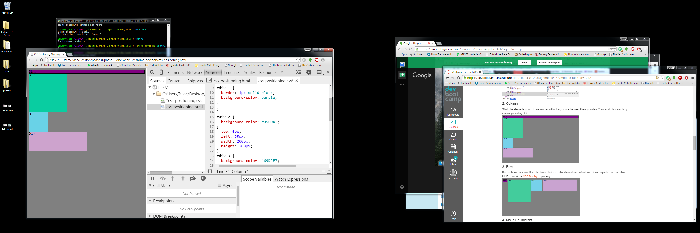
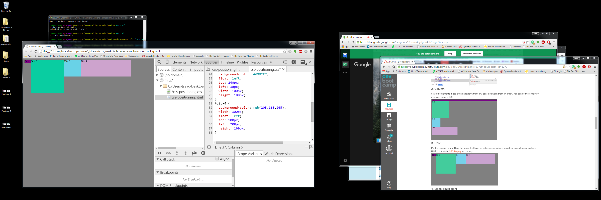
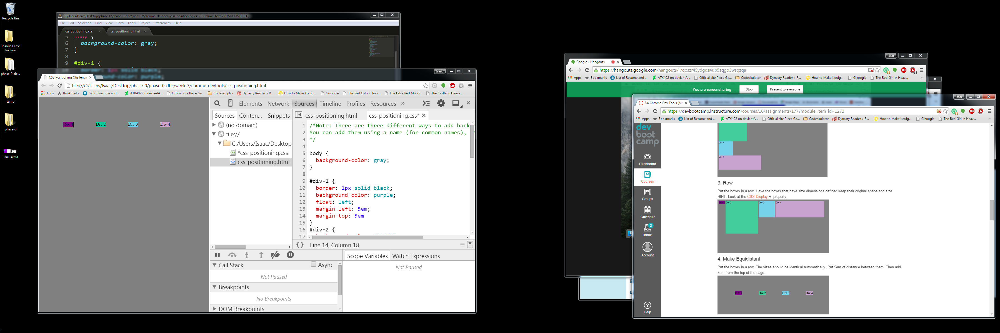
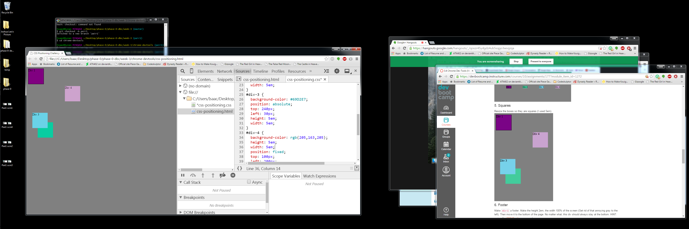
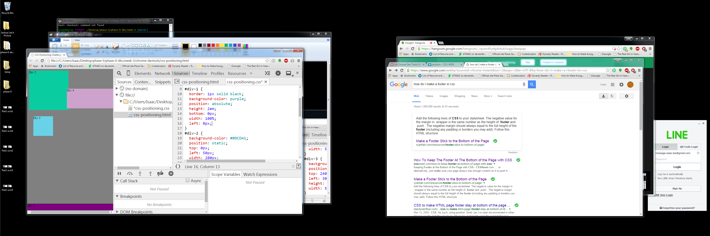
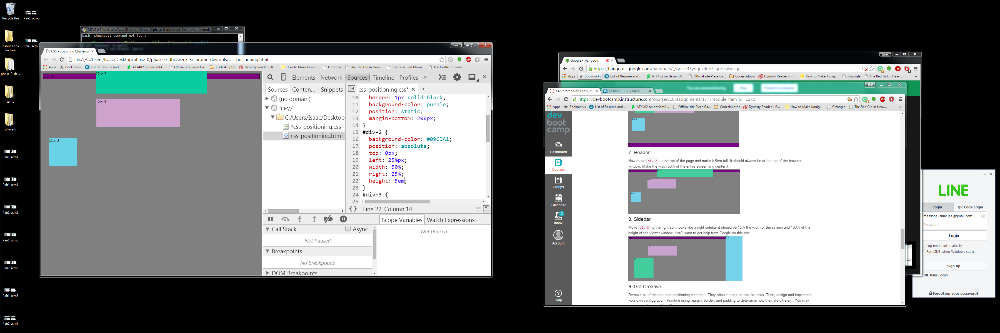
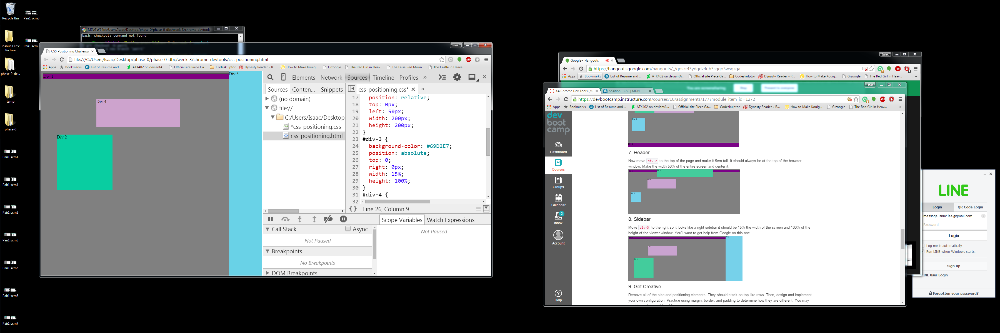
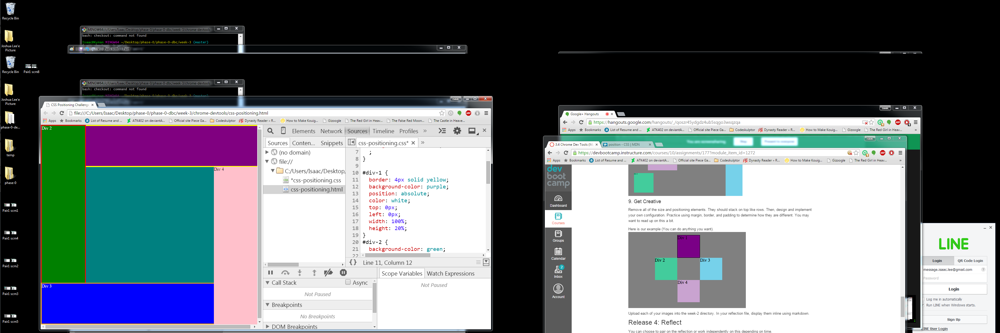

	! [image 1] (imgs/Pair1scrn1.png)
	
	
	
	
	
	
	
	

How can you use Chrome's DevTools inspector to help you format or position elements?

Inspector is a very useful tool because it allows you to see your changes to a website in real time so you don't have to check back and forth between your html, your stylesheet, and your webpage repeatedly. Instead, you can type it in and see what the changes are.

How can you resize elements on the DOM using CSS?

You specify the element using a class or by simply sating what they are, and then you can change their size or font size or anything about the specified element.

What are the differences between Absolute, Fixed, Static, and Relative positioning? Which did you find easiest to use? Which was most difficult?

Absolute positioning means that the element is taken out of the flow of a page and will be positioned exactly where it was stated.
Fixed positioning places an object in a specific area relative to the web browser and does not allow that object to move, even if the browser scrolls in any direction. 
Static positioning means that the elements will flow with the page normally. It's the default setting. 
Relative positioning shifts the element from where it would have been with static positioning.

I find absolute positioning to be the easiest to work with and relative positioning to be the hardest to work with.

What are the differences between Margin, Border, and Padding?

Margin, border, and padding are all different spaces between the content and an invisible edge.
Padding is the space between the actual content and the border.
The border is the space between the padding and the margin.
The margin is the space between the border and the next aligning margin.

What was your impression of this challenge overall? (love, hate, and why?)

I enjoyed the challenge. I found designing a website in HTML to be kind of tedious because it involved a lot of copy and pasting. Being able to seperate things into classes made a lot of sense to me.

